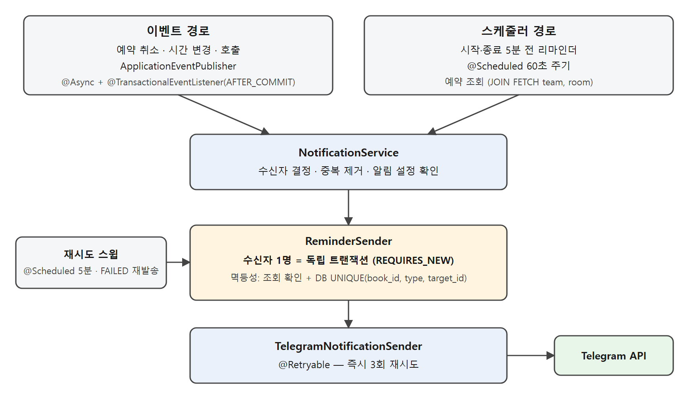

# workspace-backend

**Workspace Booking** — 회의실 예약 및 미니게임 서비스 (2인 개발)

> - 예약 도메인(book, room, user)과 알림 파이프라인(notification)으로 구성
> - 실서비스로 운영 (https://nhn.roomly.site)

## 기능

- 회의실 예약 조회·생성·취소·연장, 관리자 기능
- **텔레그램 알림** — 예약 취소/변경/호출은 이벤트 기반, 시작·종료 리마인더는 스케줄러 기반
- 미니게임(대기 중 랭킹 게임) 세션·점수 관리
- 회원가입 없이 제공된 아이디, 비밀번호로 로그인

## 알림 파이프라인

예약 취소·시간 변경·호출은 이벤트 기반(`AFTER_COMMIT`)으로 즉시 처리하고, 시작·종료 리마인더는 스케줄러가 주기적으로 조회해 발송한다. 수신자 1명 = 독립 트랜잭션으로 처리해 한 건의 발송 실패가 다른 발송에 영향을 주지 않고, 실패 시 즉시 재시도 후 별도 스윕이 다시 시도한다.

## 기술 스택

| 분류 | 스택 |
|---|---|
| Language | Java 21 |
| Framework | Spring Boot 3.3.2, Spring Data JPA, Spring Retry |
| Database | MySQL |
| Infra | Docker, Kubernetes(Rancher), Argo CD, Cloudflare Tunnel |
| CI/CD | GitHub Actions |
